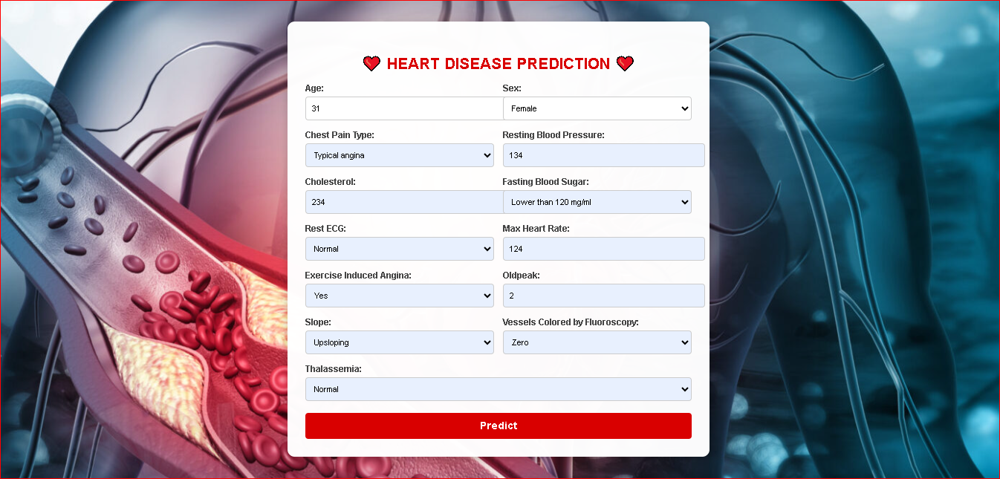
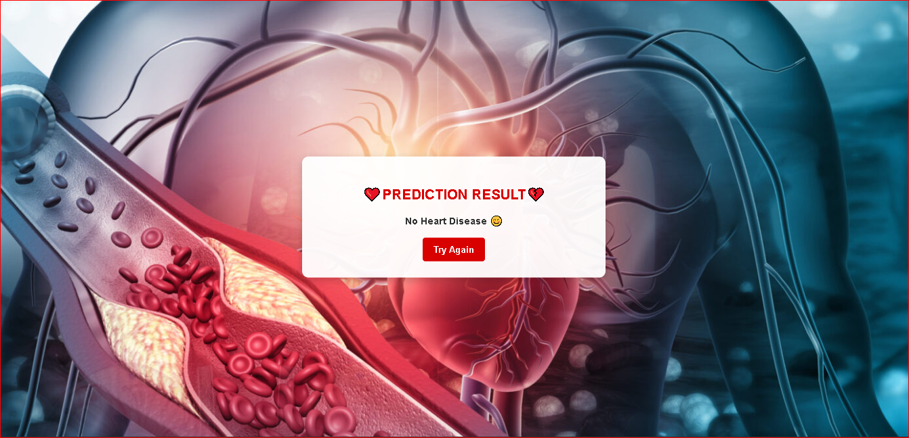

# Heart Disease Prediction System 

This is a Machine Learning-based web application for predicting heart disease using Flask and Scikit-Learn.

## 📸 Screenshots
### Homepage:


### Prediction Result:


## 🚀 Features
✅ User-friendly web interface  
✅ Machine Learning model for prediction  
✅ Flask-based backend  
✅ Scikit-learn for data preprocessing  

## 🛠️ Technologies Used
- Flask (Python web framework)
- Scikit-Learn (Machine Learning)
- HTML, CSS (Frontend)

## 🎯 How to Run Locally  
```bash
git clone https://github.com/Rakeshthathagari812/Heart-Disease-Prediction.git
cd Heart-Disease-Prediction
pip install -r requirements.txt
python app.py
